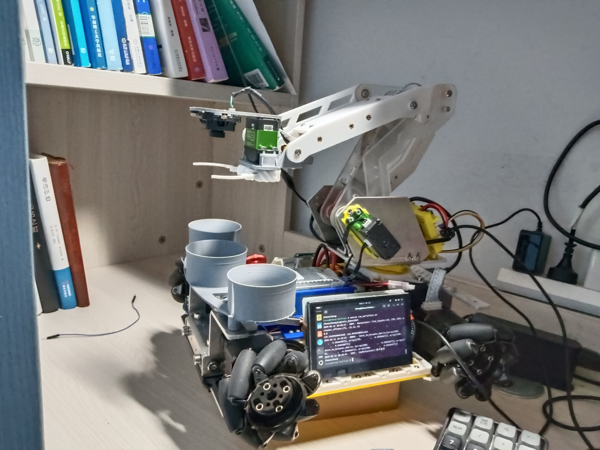
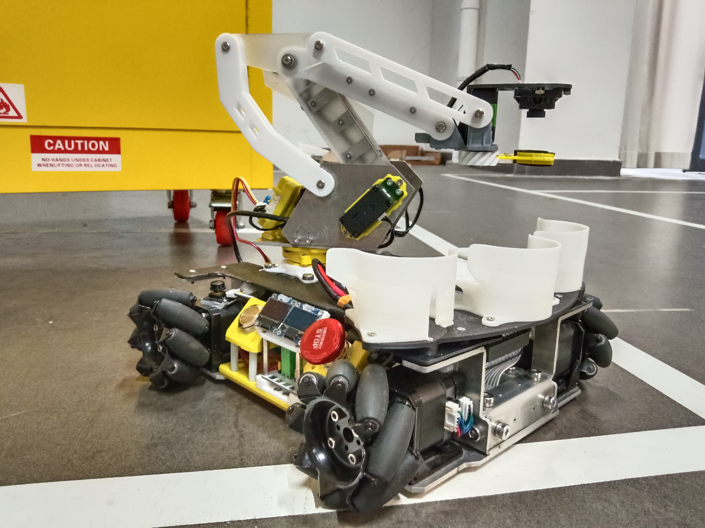

# 项目介绍
## News
- 20250715 公开项目
## 项目简介
- 本项目是一个机械臂物流机器人的高级控制程序, 用于参加2025年广东省大学生工程实践与创新能力大赛, 获得二等奖
- 本项目程序使用python编写，具备较好的可读性
<div style="display: flex; justify-content: space-between;">
  
  
</div>

- 程序流控制方面, 本项目通过创建任务管理器和定义任务实例的方式开开发了一种高度可维护的任务规划方式, 具备一定的参考意义
- 该项目有非常多的缺陷, 开发者后续会进行持续维护, 甚至重构系统架构, 请持续关注该项目, 获取最新更新咨询
## 说明文件简介
- 该说明文件包含目录结构介绍、环境配置和使用方法等内容
## 目录结构介绍
```text
Logistic_Robot2025/
├── arm_J2A_research.md
├── paspi_pinout.md
├── problem.md
├── proj
│   ├── assets
│   │   ├── images
│   │   │   ├── img_green_filter.png
│   │   │   └── img_qr.png
│   │   └── videos_temp
│   ├── frame_extraction
│   │   ├── captureVideoFrame.py
│   │   └── frame_extracted
│   ├── Generic_Mission.py
│   ├── main.py
│   ├── mission
│   │   ├── Math_Tools.py
│   │   ├── Mission_Function.py
│   │   ├── __pycache__
│   │   │   ├── Math_Tools.cpython-38.pyc
│   │   │   ├── Mission_Function.cpython-38.pyc
│   │   │   ├── Reusable_Module.cpython-38.pyc
│   │   │   ├── Run_Function.cpython-38.pyc
│   │   │   └── Setup.cpython-38.pyc
│   │   ├── Reusable_Module.py
│   │   └── Setup.py
│   ├── __pycache__
│   │   ├── Generic_Mission.cpython-38.pyc
│   │   ├── main.cpython-38.pyc
│   │   └── serial_test.cpython-38.pyc
│   └── subsystems
│       ├── AGV.py
│       ├── Buttom.py
│       ├── Computer_Vision.py
│       ├── Keyboard.py
│       ├── LED.py
│       ├── Manipulator.py
│       └── __pycache__
│           ├── AGV.cpython-38.pyc
│           ├── Buttom.cpython-38.pyc
│           ├── Computer_Vision.cpython-38.pyc
│           ├── Keyboard.cpython-38.pyc
│           └── Manipulator.cpython-38.pyc
├── README.md
├── todoList.md
└── wizards
    ├── run_gpioTest.sh
    ├── run_mainpy.sh
    └── run_test.sh
```
### ```proj```
项目程序文件
- ```asset``` 运行视频 & 图片以及文本日志保存目录
- ```frame_extraction``` 内含工具脚本, 用于读取视频中的帧, 以便进行视频日志分析
- ```Generic_Mission.py``` 通用任务, 内含测试任务定义
- ```main.py``` 主程序, 运行该脚本启动机器人
- ```mission``` 重要目录, 包含机器人任务执行函数和任务结束回调函数定义 (```Mission_Function.py```, ```Reusable_Module.py```)、任务类和任务管理器类定义 (```Setup.py```), 以及常用数学工具函数 (```Math_Tools.py```)
- ```subsystems``` 底盘、机械臂、按钮、视觉系统的驱动程序和键盘按键定义等
- ```wizards``` 程序启动脚本
### 其它
- ```problem.md``` 记录开发过程常见问题
- ```arm_J2A_research.md``` 记录关节空间到执行器空间映射关系建立方式
- ```paspi_pinout.md``` 树莓派5B引脚定义, 以及机器人引脚资源配置
- ```todoList.md``` 开发时的备忘录, 里面有一些有用的信息

## 环境配置
- 本项目需要在树莓派上运行,系统信息如下:
    ```text
    Distributor ID: Ubuntu
    Description:    Ubuntu 24.04.2 LTS
    Release:        24.04
    Codename:       noble
    ```
- python环境方面, 推荐使用miniconda 虚拟环境, 环境中安装```opencv-python```, ```serial```等库, 可能出现的问题及解决方案请参考 ```problem.md```

## 使用方式
- 通过```wizards```目录下的程序启动脚本启动
    ```bash
    source wizards/run_mainpy.sh
    ```
- 脚本启动后会在指定工作目录下寻找```main.py```, 并在指定的python环境下用sudo权限运行该python脚本
- 请自行修改脚本中的工作目录和python解释器路径
- 建议取消当前用户的sudo密码, 以便省去启动机器人时输入密码的麻烦
    - 访问特定目录下的配置文件
        ```bash
        sudo vim /etc/sudoers
        ```
        或者
        ```bash
        sudo nano /etc/sudoers
        ```
    - 在配置文件中加入下述内容 (此处的"zhang"替换为你的用户名)
        ```bash
        # cancel sudo password for user "zhang"
        zhang ALL=(ALL) NOPASSWD: ALL
        ```
- 修改脚本指定工作目录等信息后, 可将启动脚本复制到方便访问的位置(如主目录), 以便快捷启动
